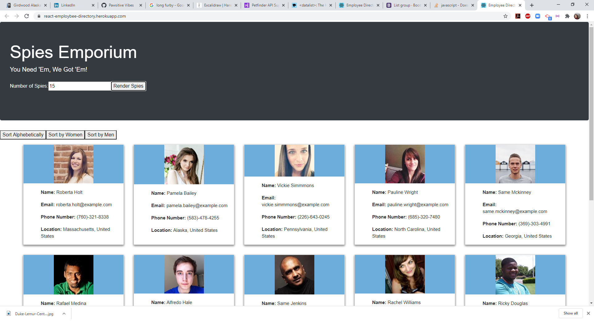

This project was bootstrapped with [Create React App](https://github.com/facebook/create-react-app).

# Employee Directory

## Description 

This is an employee directory built using react and axios, drawing employee data using a mongo database from a stock employees API. It allows a user to generate a selected number of random employees, and either sort them alphebetically or filter them by gender.

## Usage 

A user can generate a selected number of random employees and view their names, emails, phone numbers and locations, and can sort them alphebetically or filter them by gender.

## Credits

Thanks to Joe and Denis for their in-class activities and Demos, and to Cody and Trish for their moral support and troubleshooting help.

